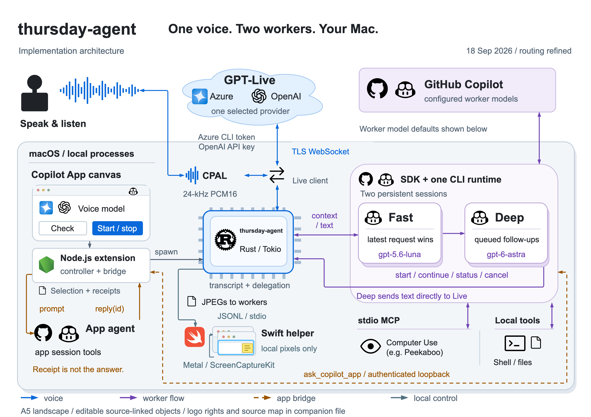

<p align="center">
  
</p>

<h1 align="center">thursday-agent</h1>

A macOS voice assistant that uses GPT-Live for conversation and GitHub Copilot
workers to control apps, use browsers, work with files, and answer questions
about your Copilot App sessions.

## Architecture

[](thursday-architecture.png)

## Requirements

macOS 14+, Rust and Cargo, Xcode command-line tools with Swift, Node.js with
`npx`, GitHub Copilot access, and a deployed GPT-Live model through Azure OpenAI
or OpenAI. Azure also requires Azure CLI.

**GPT-Realtime, chat, and embedding models are not compatible.**

## Quick start

From the project folder, build the Rust binary and native helper, then sign in:

```sh
scripts/build.sh
copilot login
```

For **Azure**, also run `az login`. For **OpenAI**, supply `OPENAI_API_KEY`
through your secret manager. Then configure and start:

```sh
./target/release/thursday-agent setup
./target/release/thursday-agent voice-check
./target/release/thursday-agent run
```

`voice-check` checks the connection without enabling the microphone or computer
controls. Press **Ctrl-C** to stop the running assistant.

## Copilot App canvas

Open this folder in Copilot App, reload extensions, and open the **thursday-agent** canvas.

1. In **Setup**, choose a provider and model. For Azure, select the tenant,
   subscription, resource, and deployed GPT-Live model.
2. Select **Save model**, then **Diagnosis > Check connection**.
3. Select **Voice > Start thursday-agent**. This enables the microphone and Mac controls.

Select **Stop thursday-agent**, or close the last thursday-agent canvas, to stop.
The canvas uses the local release binary; it does not build it automatically.
After source changes, run `scripts/build.sh`, then stop and start the assistant.

OpenAI requires `OPENAI_API_KEY` in the extension process. If it is unavailable,
restart Copilot App with the variable supplied. Azure uses short-lived CLI
tokens, not an Azure API key, and never falls back to OpenAI after an authentication failure.

## Permissions and settings

Check **Diagnosis > Mac permissions**. Grant **Accessibility** and **Screen Recording**
in **System Settings > Privacy & Security** to the app that launches thursday-agent.
Event Synthesizing uses Accessibility. Quit and reopen that app after changing permissions.
Missing Mac control permissions do not block voice-only or app-session requests.

Voice selection follows **CLI flags > saved selection > environment defaults**.
Preferences are stored in `~/Library/Application Support/thursday/config.json`,
or the path set by `THURSDAY_CONFIG`. Keep credentials and configuration files private.

Use `--workspace <PATH>` to choose the working folder, `--no-helper` to disable
window effects, and `--help` for all options. To ask about Copilot App sessions,
start through the canvas and say, for example, "List all sessions and their current activity."

## Development

```sh
cargo test
bash scripts/test-helper.sh
node --test .github/extensions/thursday/extension.test.mjs
```

## License

[MIT](LICENSE), copyright 2026 Aymen Furter.
Azure and OpenAI canvas marks: [Simple Icons 11.15.0](https://github.com/simple-icons/simple-icons/tree/11.15.0),
[CC0-1.0](https://github.com/simple-icons/simple-icons/blob/11.15.0/LICENSE.md).
